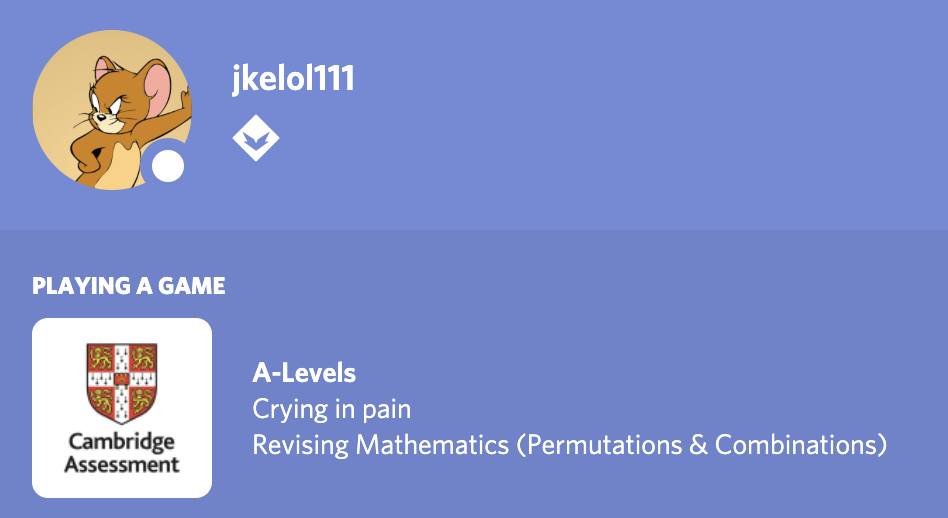

# CustomDiscordPresence

> Ever wanted to set your own rich presence?

> Want to stay swag and cool among the other lame rich presences?

> Always wanted to start a conversation your crush on Discord?

CustomDiscordPresence is a simple Python script that helps you do exactly that! (~~except the crush part but let's just keep it there for the sake of attractiveness~~).

It's simple to setup too, so you'd be up and flexing your brand spanking new, special and fragilicious Rich Presence in no time.

Not to mention we should work anywhere the Discord Desktop app works properly too! 

## Setting up
0. Set up a Discord Developer Application

- Go to Discord's Developer Portal: https://discord.com/developers/applications
- Create a new application (the name will be the one displayed in the Rich Presence).
- Add some image assets if you want to (highly recommended for swag).

1. Download a release

Get the latest release from [here](releases) for your appropiate platform, or get a copy of the source code to run yourself.

Don't forget to extract it!

2. Get your config file filled up

Make a copy of `cdrpcfg-template.json` and name it `cdrpcfg.json`

Fill up that new file with the required fields, using the [configuration file layout](#configuration-file-layout) as your helping hand. Optional fields are marked with `null`.

3. Start CustomRichPresence

Double click on the CustomRichPresence app to start displaying your Rich Presence.

Ctrl+C will stop the Rich Presence while the app is in focus.

You may be warned to trust the app. Don't worry about it, I won't put anything suspicious on your device, look at the code yourself. So trust it!

## Configuration file layout
- `client_id`:  Your app's client ID. Get it from the Discord Developer Portal.
- `state`:
    - `state`: The state. (this is displayed on the second line, see above screenshot)
    - `details`: The state's details. (this is displayed on the first line, see above screenshot)
    - `timestamps`:
        - `start`: the start timestamp in Unix time epoch.
        - `end`: the ending timestamp in Unix time epoch.
- `images`:
    - `large`:
        - `name`: The name of the large image (set it to the one you have in your Discord Developer Portal).
        - `tooltip`: The text that is shown when the large image is hovered.
    - `small`:
        - `name`: The name of the small image (set it to the one you have in your Discord Developer Portal).
        - `tooltip`: The text that is shown when the small image is hovered.